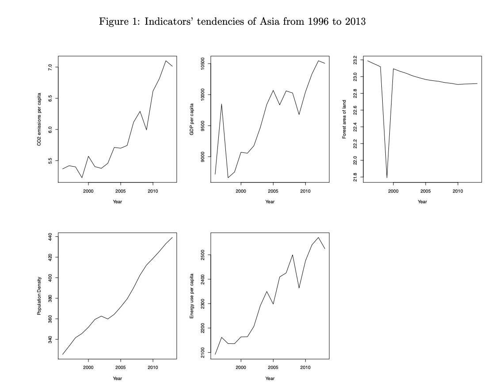
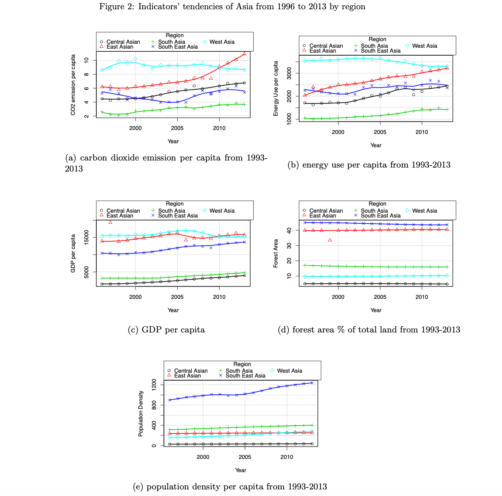
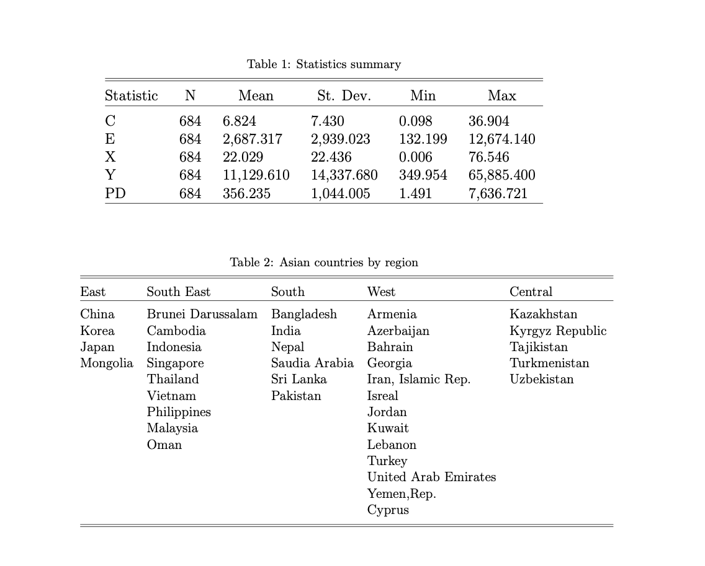

# Econometrics_Project:
Title :Effects of Energy Consumption and Economic Growth on Carbon Dioxide Emissions in Asia 

# Purpose:
 To figure out how the carbon dioxide emissions influences economic growth in Asia 
 
# Methodology:
- Used the Macroeconomics Model to derive an equation for economic growth
- Used R to make regressions for the panel data and got the results

# EDA:

# Conclusion
This paper anlyzed the major determinants of CO2 emissions for 37 Asian countries using annual data from the period 1996-2013. We also analyzed the the relationship based on 5 regions of these countries, which are East Aisa, West Aisa, Central Aisa, South Aisa and South East Aisa.The relationship among CO2 emissions, energy consumption and economic growth has been found in our empirical results. Fixed effect model is used to examine the energy use and real output sensitivity on CO2 emissions.
Our results show that GDP growth has a negative significant effect on CO2 emissions in East Asia. One possible explanation is that as GDP in- ceases, citizens’ awareness rises. Producers are aware about the environmen- tal degradation that is caused by GHG and trying to reduce CO2 emissions. It is not surprising to find that energy consumption has a positive significant effect on CO2 emissions across all the regions in Aisa. The expansion of output requires additional energy usage which generates more emissions. We also found negative significant effect of population density on CO2 emissions. One possible reason is that in the area with high population density, people rely more on the public transortation services and walking accessibility, in- stead of vehicular population. It is also not surprising to expect a negative relation ship between freast area and CO2 emissions. Deforestation can be considered to be the second largest anthropogenic source of CO2 emissions after fossil fuel usage.
As we can see from the results, the relavent emission reduction variable is energy consumption. Countries should consider environmental policies that reduce energy consumption but do not harm long term economic growth. Exploiting renewable and environmental friendly energy sources is one of the efficient strategies with repect to enery consumption. Countries should also find a smart may to grow the urban residential densities depend on local consitions so that it may reduce CO2 emissions. Besides, countries should be urged to develop policies to manage forest area in a sustainably way.
